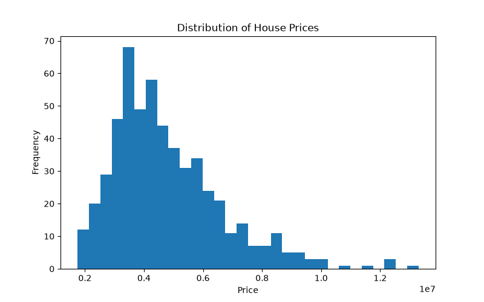
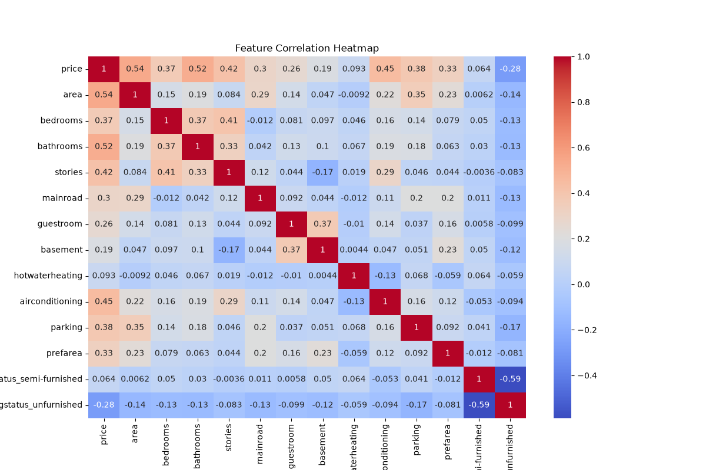
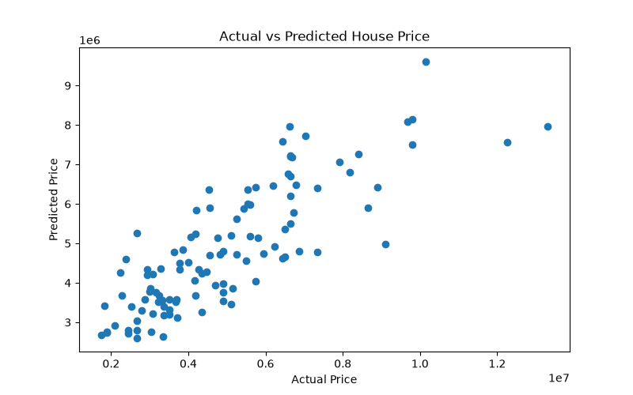
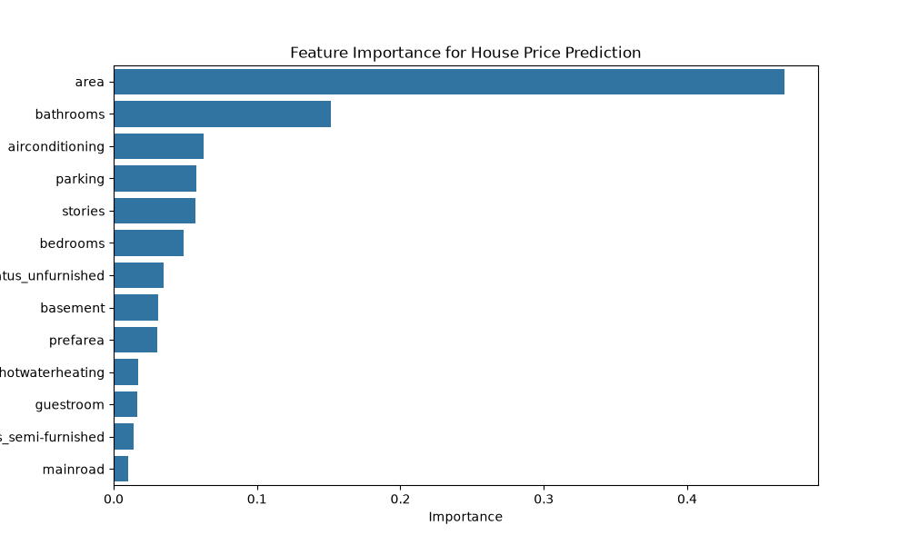

# 🏠 House Price Prediction

## 📌 Project Overview

This project focuses on predicting house prices using Machine Learning regression models.  
The goal is to analyze housing data, identify important features affecting prices, and build models that can estimate property values.

## 🎯 Objective

- Clean and preprocess housing data
- Perform exploratory data analysis
- Build regression models
- Compare model performance
- Identify key factors influencing house prices

## 🛠️ Technologies Used

- Python
- Pandas
- NumPy
- Scikit-learn
- Matplotlib
- Seaborn
- Jupyter Notebook

## 📂 Dataset Features

The dataset contains features such as:

- Area
- Bedrooms
- Bathrooms
- Stories
- Parking
- Air Conditioning
- Guest Room
- Basement
- Furnishing Status
- Preferred Area

## 🤖 Machine Learning Models

### 1. Linear Regression

Performance:

- MAE: 970043
- RMSE: 1324507
- R² Score: 0.65

### 2. Random Forest Regressor

Performance:

- MAE: 1022560
- RMSE: 1401497
- R² Score: 0.61

## 📊 Visualizations

## 📊 Visualizations

### House Price Distribution

### Feature Correlation Heatmap

### Actual vs Predicted Prices

### Feature Importance

## 🔍 Key Insights

- Area has the highest impact on house price.
- Bathrooms, air conditioning, parking, and stories also influence price.
- Linear Regression performed slightly better than Random Forest on this dataset.

## 📁 Project Structure
